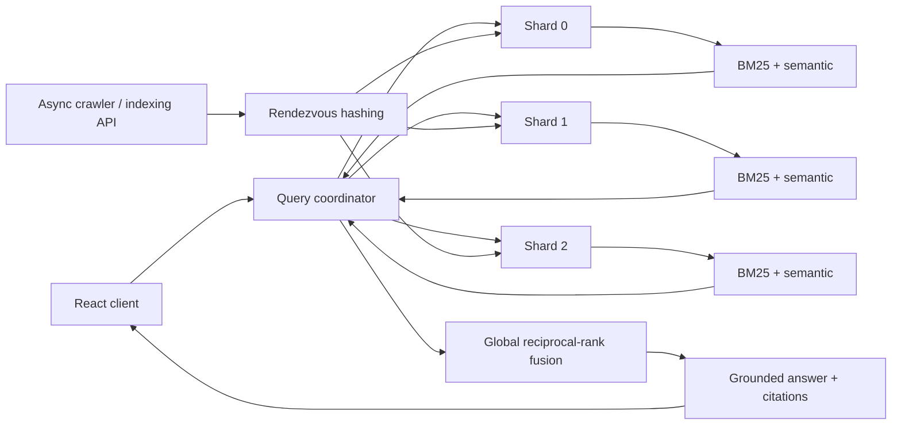

# Nexus — Distributed AI Search Engine

Nexus is a from-first-principles search engine that combines a **custom BM25 inverted index**, **semantic retrieval**, **reciprocal-rank fusion**, an asynchronous web crawler, and a **citation-grounded answer layer**. Version 2 adds a real coordinator/shard architecture: queries fan out across independently deployed search shards and global top-k results are merged at the coordinator.

## Architecture



## What is implemented

- **BM25 from scratch** — tokenizer, posting lists, document frequency/IDF, length normalization and ranked retrieval.
- **Semantic retrieval** — OpenAI embeddings when configured; local TF-IDF + NumPy SVD latent-semantic fallback otherwise.
- **Hybrid retrieval** — RRF combines lexical and semantic rankings without mixing incompatible raw score scales.
- **Distributed query fan-out** — a coordinator concurrently queries multiple independent shard services and performs a second global rank-fusion pass.
- **Deterministic sharding** — highest-random-weight / rendezvous hashing assigns each document to exactly one shard and minimizes movement when the node set changes.
- **Distributed indexing path** — coordinator routes manual/crawled documents to their owning shard; shard-internal endpoints are protected by a cluster token.
- **Failure-aware search** — coordinator merges responses from available shards instead of failing the entire query when one shard is unavailable.
- **Grounded answers** — citation-aware answer synthesis with a deterministic extractive fallback when no LLM key is configured.
- **Async crawler** — `robots.txt`, URL canonicalization, duplicate-content hashing, depth/page controls, SSRF/private-network protection.
- **FastAPI + React UI** — API docs, latency/index metrics, shard attribution on results, and cluster-health display.
- **Docker + Railway** — one image supports `standalone`, `coordinator`, and `shard` roles through environment configuration.
- **Automated tests** — search, API, deduplication, rendezvous-hash stability/distribution, seed partitioning, and shard-rank merge behavior.

## Service roles

Nexus uses one container image for every node:

```text
SERVICE_ROLE=standalone   # one-node development mode
SERVICE_ROLE=coordinator  # public API/UI + query fan-out
SERVICE_ROLE=shard        # owns a subset of the index
```

A three-shard local cluster is included:

```bash
docker compose -f docker-compose.distributed.yml up --build
```

The coordinator is then available at `http://localhost:8000`.

## Distributed configuration

Coordinator:

```text
SERVICE_ROLE=coordinator
SHARD_COUNT=3
SHARD_URLS=0=http://shard-0:8000,1=http://shard-1:8000,2=http://shard-2:8000
CLUSTER_TOKEN=<shared-secret>
```

Shard:

```text
SERVICE_ROLE=shard
SHARD_ID=0
SHARD_COUNT=3
CLUSTER_TOKEN=<shared-secret>
```

At startup each shard deterministically loads only the seed documents it owns. New documents are routed by the coordinator using the same rendezvous-hash function.

## API

| Endpoint | Method | Purpose |
| --- | --- | --- |
| `/api/health` | GET | node health and role |
| `/api/stats` | GET | local or aggregated cluster statistics |
| `/api/search?q=...&mode=hybrid` | GET | distributed lexical/semantic/hybrid search |
| `/api/ask` | POST | grounded answer + citations |
| `/api/index/document` | POST | route a document to its owning shard (admin) |
| `/api/crawl` | POST | crawl and distribute indexed pages (admin) |
| `/docs` | GET | OpenAPI docs |

Shard-internal `/internal/*` endpoints require `X-Cluster-Token` and are not used directly by the browser.

## Tests

```bash
python -m venv .venv
source .venv/bin/activate
pip install -r backend/requirements-dev.txt
PYTHONPATH=backend pytest -q backend/tests
```

Current test suite: **12 passing tests**.

## Benchmarks

Single-node algorithm benchmark:

```bash
python scripts/benchmark.py
```

The checked-in synthetic run indexed 1,200 generated documents and measured **0.433 ms p95 in-process hybrid retrieval** across 120 queries. This is intentionally an algorithm-level benchmark, not an internet-scale production claim.

After bringing up the distributed cluster, measure end-to-end coordinator latency with:

```bash
python scripts/cluster_benchmark.py --base-url http://localhost:8000
```

Production/network numbers should only be added to the resume after running that benchmark against the deployed cluster.

## Next engineering milestones

The distributed query path is now implemented. The next month of work is deliberately focused on deeper production properties rather than adding superficial features:

1. durable shard persistence and incremental indexing;
2. ANN/HNSW vector retrieval rather than dense scan;
3. Kafka-backed crawl/index jobs with retries and dead-letter handling;
4. replica groups, health-based routing and shard failover;
5. retrieval evaluation using Recall@K, MRR and nDCG;
6. OpenTelemetry traces and Prometheus/Grafana dashboards;
7. Kubernetes manifests, autoscaling and controlled failure tests.

## Interview talking points

- Why BM25 remains useful alongside vector search.
- How an inverted index changes query complexity.
- Why RRF is used both inside a shard and across shards.
- Why shard-local BM25 scores should not be naively summed across machines.
- Rendezvous hashing vs modulo hashing vs a consistent-hash ring.
- Partial-result behavior when a shard times out.
- How to add replicas without duplicating results.
- How to make rebalancing safe when the shard set changes.
- Retrieval quality vs generation quality in RAG systems.

## License

MIT
