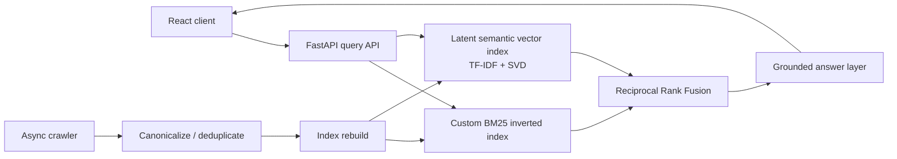

# Nexus — AI Search & Retrieval Engine

Nexus is a search engine built to demonstrate the pieces behind modern AI search instead of hiding them behind Elasticsearch or a vector-database SDK. It combines a **custom BM25 inverted index**, a **semantic vector index with optional neural embeddings and a local SVD fallback**, **reciprocal-rank fusion**, an asynchronous web crawler, and a **citation-grounded answer layer** behind a FastAPI + React application.

> Status: deployable MVP. Distributed sharding, durable index storage, and neural embedding/reranking are intentionally listed as the next engineering phase rather than claimed as complete.

## Why this project

A normal RAG demo often starts with a managed vector database and finishes with an LLM call. Nexus starts lower in the stack: indexing, ranking, semantic projection, rank fusion, crawling, deduplication, grounding, API design, observability-friendly metrics, and deployment.

## Architecture



## Implemented

- **BM25 from scratch** — tokenizer, document frequencies, posting lists, length normalization, IDF, ranking.
- **Semantic retrieval** — uses OpenAI `text-embedding-3-small` when configured, with a fully local TF-IDF + NumPy SVD latent-semantic fallback so search remains available without an external model.
- **Hybrid ranking** — Reciprocal Rank Fusion combines lexical and semantic rankings without assuming compatible score scales.
- **Grounded answers** — top evidence is synthesized with inline citations when an OpenAI API key is configured; otherwise Nexus uses a deterministic extractive fallback so the public demo remains functional.
- **Async crawler** — seed URLs, depth/page limits, same-domain mode, `robots.txt`, canonicalized URLs, duplicate-content hashing, HTML extraction, private-network/localhost blocking.
- **Admin isolation** — crawl and manual-index endpoints are disabled unless `ADMIN_TOKEN` is configured.
- **React search UI** — search modes, score breakdown, citations, architecture view, and live latency/index stats.
- **FastAPI API** — OpenAPI docs at `/docs`, typed Pydantic contracts, CORS, health endpoint.
- **Docker/Railway deploy** — multi-stage container builds the React app and serves it from FastAPI.
- **Automated tests + CI** — API, ranking, semantic retrieval, hybrid scoring, and deduplication tests.

## API

| Endpoint | Method | Purpose |
| --- | --- | --- |
| `/api/health` | GET | health check |
| `/api/stats` | GET | index/query statistics |
| `/api/search?q=...&mode=hybrid` | GET | lexical, semantic, or hybrid search |
| `/api/ask` | POST | grounded answer + citations |
| `/api/index/document` | POST | add a document (admin) |
| `/api/crawl` | POST | crawl and index web pages (admin) |
| `/docs` | GET | interactive OpenAPI docs |

## Run locally

### Backend

```bash
python -m venv .venv
source .venv/bin/activate
pip install -r backend/requirements-dev.txt
PYTHONPATH=backend uvicorn app.main:app --reload
```

### Frontend

```bash
cd frontend
npm install
npm run dev
```

Vite proxies `/api` to `localhost:8000`.

### Tests

```bash
PYTHONPATH=backend pytest -q backend/tests
```

Current result: **8 passing tests**.

### Benchmark

```bash
python scripts/benchmark.py
```

The checked-in run indexed 1,200 generated documents and measured **0.433 ms p95 in-process hybrid retrieval** across 120 queries. See [`BENCHMARK.md`](BENCHMARK.md) for the exact scope and caveats.

## Docker

```bash
docker build -t nexus-search .
docker run --rm -p 8000:8000 nexus-search
```

Open `http://localhost:8000`.

## Railway

The repository includes `railway.json` and a health endpoint. Deploy from the repository root. Optional environment variables:

```text
OPENAI_API_KEY=...       # enables neural embeddings + LLM synthesis; do not commit the key
ANSWER_MODEL=gpt-5-mini
ADMIN_TOKEN=...          # enables crawl/index write endpoints
ENVIRONMENT=production
```

The app is usable without an OpenAI key: retrieval, ranking, citations, crawler code, metrics, and the extractive grounded-answer fallback continue to work.

## Benchmark notes

Do not market the included numbers as internet-scale throughput. They intentionally measure the search algorithms in isolation and are reproducible from source. Real production benchmarking should include HTTP latency, concurrent load, a much larger corpus, durable storage, and multiple nodes.

## Next phase: actual distributed search

The next month of work should add the pieces that turn this MVP into the full distributed version:

1. shard documents with consistent hashing;
2. deploy query/index shards as independent services;
3. fan out queries from a coordinator and merge top-k results;
4. persist indexes and crawl frontier state;
5. add neural embeddings + approximate nearest-neighbor search;
6. add reranking and retrieval evaluation (Recall@K / nDCG / MRR);
7. Kafka-backed crawl/index jobs and dead-letter processing;
8. OpenTelemetry traces + Prometheus/Grafana dashboards;
9. Kubernetes deployment and failure/recovery tests.

That roadmap is deliberately separate from the features already implemented, so the repository stays defensible in an interview.

## Interview talking points

- Why BM25 still matters when vector search exists.
- How an inverted index avoids scanning the whole corpus.
- Why RRF is safer than naïvely adding BM25 and cosine scores.
- How SVD creates a latent semantic space and where it loses to neural embeddings.
- How duplicate crawling, retry behavior, rate limiting, and `robots.txt` affect a crawler.
- Why RAG quality should be split into retrieval quality and generation quality.
- How to shard the index and merge top-k results across nodes.
- How to make indexing incremental instead of rebuilding the semantic matrix.

## License

MIT
