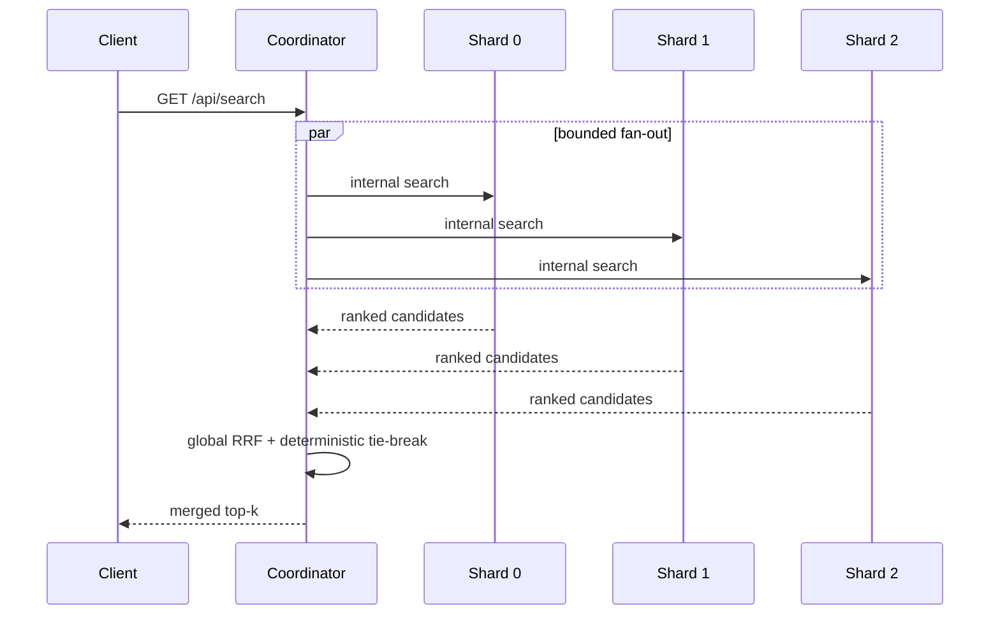

# Nexus Architecture

## 1. System boundary

Nexus is a distributed hybrid-search application. The public coordinator accepts search, answer, crawl, and indexing requests. Search shards own disjoint subsets of the document corpus and maintain their own retrieval structures.

The current topology is **sharded, not replicated**: a document is assigned to one shard by rendezvous hashing. Losing a shard can therefore reduce recall until that shard recovers.

## 2. Query path



Each shard performs lexical, semantic, or hybrid retrieval locally. The coordinator merges shard-level ranked lists instead of directly comparing raw shard-local relevance scores.

## 3. Indexing path

Synchronous writes are routed by the coordinator to the document's owner shard using rendezvous hashing.

The asynchronous path is:

```text
client -> /api/index/async -> Kafka/Redpanda -> index worker
       -> rendezvous-hash owner -> shard internal indexing endpoint
       -> PostgreSQL-backed document state + in-memory retrieval structures
```

The worker uses retry/backoff and dead-letter routing. Processing is designed around at-least-once delivery, while deterministic placement and idempotent storage reduce duplicate-write impact.

## 4. Durability model

When `DATABASE_URL` is configured, shard document state is stored in PostgreSQL. At startup, each shard loads its owned documents and rebuilds local BM25/semantic structures.

This is durable document state, not durable in-memory index files.

Current limitation: a mutation can update an in-memory shard before a backing-store write fully completes; the project does not claim transactional exactly-once indexing across Kafka, HTTP, and PostgreSQL.

## 5. Resilience model

### Shard timeout

Coordinator shard calls have bounded timeouts. A slow shard does not wait indefinitely.

### Circuit breaker

Each shard has an independent breaker state:

```text
closed -> repeated failures -> open
open -> recovery interval -> half-open
half-open success -> closed
half-open failure -> open
```

The breaker isolates repeated failures from one shard without disabling healthy shards.

### Bounded fan-out

Shard calls are protected by concurrency bounds so one coordinator does not create an unbounded number of simultaneous shard calls.

### Admission control

Expensive public paths use a process-local in-flight capacity gate. When the process is full, new work receives HTTP 503 with `Retry-After` rather than being admitted into an unbounded application-level waiter queue.

The current gate is per process, not a global cross-pod rate limiter.

## 6. Liveness and readiness

`/api/health` answers whether the process itself is alive.

`/api/ready` answers whether the process should receive traffic.

For a coordinator, readiness depends on the configured minimum number of healthy shards. Kubernetes uses these endpoints as separate liveness/readiness probes.

This distinction allows a coordinator process to remain alive while being removed from traffic because its dependency health is insufficient.

## 7. Observability

Nexus exposes metrics for:

- HTTP requests;
- shard calls;
- indexing success/failure;
- retries and DLQ paths;
- Kafka consumer lag;
- request-gate outcomes and in-flight requests.

OpenTelemetry context propagation is supported across API/shard calls and Kafka trace headers. The project does not claim a production tracing backend unless one is configured externally.

## 8. Kubernetes topology

The checked-in manifests deploy:

```text
nexus-coordinator
nexus-shard-0
nexus-shard-1
nexus-shard-2
```

Each shard has its own Service. The coordinator resolves shards by Kubernetes DNS through `SHARD_URLS`.

The manifests also include:

- resource requests and limits;
- ConfigMap configuration;
- Secret references;
- readiness probes;
- liveness probes;
- Kustomize rendering.

PostgreSQL and Kafka/Redpanda are external dependencies in the Kubernetes manifests rather than being provisioned as part of the search-tier deployment.

## 9. Scaling model

### Coordinator

The coordinator is largely stateless with respect to search data and can conceptually be replicated behind a load balancer. Process-local admission control means each replica has its own capacity budget.

### Shards

Adding more shard IDs changes rendezvous-hash ownership for only part of the corpus, but Nexus does not yet implement an automated online rebalancing protocol.

### Replication

True shard high availability would require replica groups, health-aware routing, duplicate-result suppression, durable ownership/rebalancing state, and a write-consistency policy. The present topology should not be described as replicated.

## 10. Consistency choices

Nexus favors availability for search reads: the coordinator can return results from surviving shards if one shard fails.

That creates a temporary completeness tradeoff: HTTP 200 can mean a valid but incomplete result set when a shard is unavailable.

Readiness is stricter and can be configured to stop routing traffic to a coordinator if too few shards remain healthy.

## 11. Security boundaries

- public/admin operations are separated from cluster-internal operations;
- shard-internal endpoints require a shared cluster token;
- admin mutations require an admin token when enabled;
- crawler URLs are constrained against private-network/SSRF targets;
- secrets belong in runtime secret management, not source control.

The checked-in Kubernetes secret file is only a local-development example and must not be used as a production secret-management strategy.
