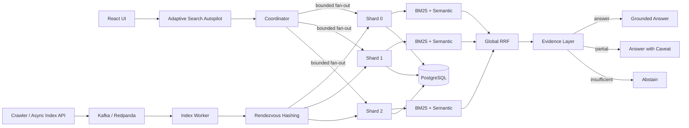

# Nexus Architecture — One Page

## Read path

`query -> adaptive plan -> coordinator -> concurrent shard search -> local BM25/semantic/hybrid -> global RRF -> evidence checks -> answer/caveat/abstain`

## Write path

`crawl/index -> Kafka/Redpanda -> worker -> rendezvous owner -> shard -> PostgreSQL durable state -> serving index`

## Evidence path

`raw candidates -> relevance -> exact identifier -> sentence support -> answerability -> authority/coverage/diversity -> agreement/conflict -> final decision`

## Reliability controls

`timeouts + circuit breakers + bounded fan-out + admission control + readiness/liveness + partial-result search + Kubernetes failure tests`

## Current non-claims

`not internet scale · not exactly-once · not replicated shard failover · not calibrated factual accuracy · not semantic/NLI contradiction detection`
