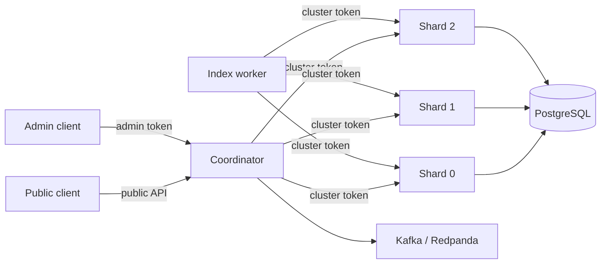

# Nexus Security / Threat Model

This document describes the security boundaries that are implemented in Nexus today, the assumptions they rely on, and the controls that are still out of scope.

## 1. Assets to protect

Nexus handles several distinct asset classes:

- indexed document content and metadata;
- administrative indexing/crawling capabilities;
- internal shard APIs;
- shared cluster credentials;
- database credentials;
- Kafka/Redpanda connection details;
- optional external model API keys;
- operational metrics and traces.

The most security-sensitive operations are document mutation, crawling arbitrary URLs, and access to cluster-internal shard endpoints.

## 2. Trust boundaries

The browser/public caller is not trusted with internal shard credentials. Internal shard APIs are intended for coordinator/worker traffic only.

## 3. Implemented controls

### Internal API authentication

Shard-internal endpoints require the shared `CLUSTER_TOKEN` through `X-Cluster-Token`.

This prevents an unauthenticated public caller from directly invoking the internal shard control surface when deployment/networking is configured correctly.

Current limitation: this is a shared secret, not workload identity or mutual TLS.

### Administrative authentication

Administrative mutation endpoints use `ADMIN_TOKEN` when configured.

Admin credentials must be injected at runtime and must not be committed to source control.

### SSRF / crawler restrictions

The crawler includes protections intended to reject private-network and otherwise unsafe targets before fetching.

This is important because a crawler can otherwise become a server-side request forgery primitive against internal infrastructure.

### Secret separation

Application settings read credentials from environment variables. Kubernetes manifests reference a Secret resource separately from ConfigMap-based non-secret configuration.

The checked-in Kubernetes secret example is for local development only and must not be treated as production secret management.

### Resource exhaustion controls

Nexus includes several controls that reduce denial-of-service impact:

- process-level request admission control;
- bounded shard fan-out concurrency;
- shard-call timeouts;
- per-shard circuit breakers;
- Kubernetes CPU/memory requests and limits.

These controls improve failure isolation but do not replace a network-edge rate limiter, WAF, authentication service, or distributed quota system.

### Failure isolation

A single unhealthy shard is isolated by timeout/circuit-breaker behavior instead of automatically failing all healthy shard calls.

This is an availability control rather than an authorization control, but it reduces cascading-failure risk.

## 4. Threat analysis

| Threat | Current mitigation | Remaining risk |
| --- | --- | --- |
| Public caller reaches internal shard endpoint | cluster-token authentication + private-service deployment model | shared token can be reused if leaked |
| Unauthorized index mutation | admin token | no per-user RBAC/identity model |
| SSRF through crawler | private-network / unsafe-target checks | URL parser/DNS edge cases still require continuous testing |
| Request flood | admission control + bounded fan-out | no global distributed rate limit or edge WAF |
| Slow/failing shard causes cascading latency | timeout + breaker + bounded concurrency | coordinator still depends on surviving shard latency |
| Duplicate Kafka delivery | idempotent/deduplicated storage behavior | not an exactly-once transaction across Kafka/HTTP/Postgres |
| Secret committed to Git | runtime env/Secret convention | repository process must still prevent accidental commits |
| Metrics leak operational data | metrics can be disabled/configured | production exposure policy must be enforced externally |
| Compromised coordinator calls shards | shared cluster token authorizes it | no per-workload identity or mTLS |
| Database credential theft | runtime environment injection | no built-in secret rotation mechanism |
| Malicious indexed content influences answer generation | citation-grounded retrieval/synthesis boundaries | prompt injection/content poisoning remains a RAG threat |

## 5. RAG-specific threats

### Prompt injection in indexed documents

Search content is untrusted input. A retrieved document may contain instructions such as "ignore prior instructions" or attempts to manipulate answer generation.

The system should treat retrieved text as evidence, not authority over system/developer instructions.

Nexus does not currently claim a full prompt-injection defense layer.

### Retrieval poisoning

An attacker who can index content could try to flood the corpus with documents designed to dominate ranking.

Mitigations that would be needed for a production multi-tenant system include source trust, per-source quotas, abuse detection, provenance, and moderation of indexing privileges.

### Citation correctness

A citation proves which source text was retrieved, not that the source itself is true.

Nexus therefore treats citations as provenance, not factual verification.

## 6. Production-hardening backlog

High-value future controls include:

- workload identity or mTLS between coordinator/worker and shards;
- external secret manager + rotation;
- per-user/admin identity and RBAC;
- network policies between Kubernetes workloads;
- ingress authentication, edge rate limiting, and WAF protections;
- signed service-to-service requests with short-lived credentials;
- dependency/container image scanning;
- SBOM generation;
- structured audit logging for admin operations;
- prompt-injection and retrieval-poisoning evaluation;
- automated secret scanning in CI.

## 7. Security claims Nexus does not make

Nexus does not currently claim:

- zero-trust service-to-service security;
- tenant isolation;
- per-user RBAC;
- mTLS;
- cryptographic workload identity;
- a production WAF;
- production secret rotation;
- end-to-end exactly-once indexing;
- full prompt-injection immunity.
